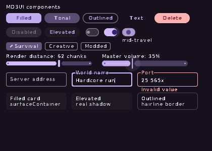
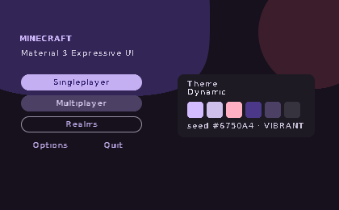
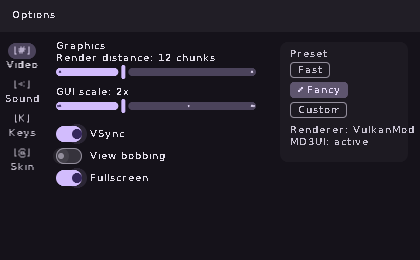
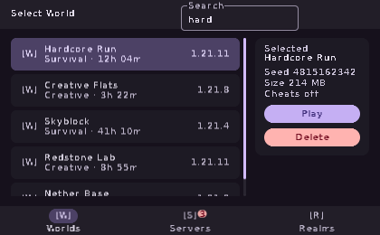
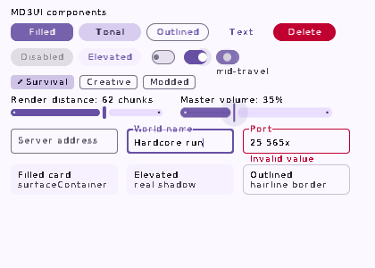
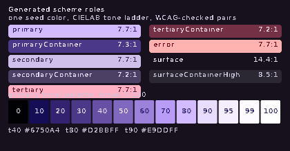
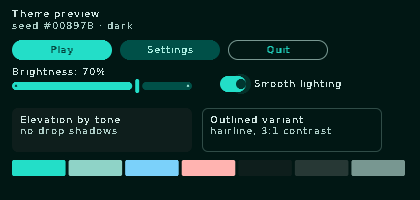
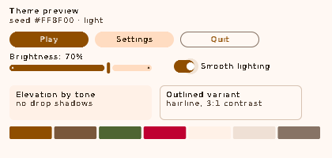

# MD3UI

Minecraft's menus rebuilt in **Material Design 3 Expressive** — generated colour,
spring physics, and a renderer that stays out of VulkanMod's way.

[](https://github.com/degradatione-cloud/MD3UI/actions/workflows/build.yml)




Every image in this README is rendered by the mod's own drawing code in CI, not
mocked up in a design tool. If a widget regresses, the screenshot changes.

---

## Why another UI mod

Most "modern UI" mods for Minecraft do one of two things: ship a texture pack
that recolours vanilla nine-slice art, or bring a custom renderer with its own
shaders and vertex buffers. The first cannot change layout or motion. The second
fights every performance mod you have installed, because shaders and
`RenderPipeline` are precisely what VulkanMod and Sodium replace.

MD3UI takes a third route. **All drawing goes through two vanilla calls** —
`GuiGraphics.fill` and `drawString` — and every rounded corner, ripple, shadow and
superellipse is decomposed into axis-aligned rectangles by a scanline solver
before it reaches the game. There is nothing for a renderer replacement to
disagree with.

| | Texture pack | Custom-renderer UI mod | MD3UI |
|---|---|---|---|
| Change layout | no | yes | yes |
| Animation | no | yes | yes, spring-based |
| Works with VulkanMod | yes | usually breaks | yes, by construction |
| Mixins | none | many | **none** |
| Custom shaders | none | yes | **none** |
| Other mods' buttons | untouched | often lost | adopted and restyled |

---

## Compatibility

The compatibility claim is structural, not empirical:

- **No mixins.** The jar contains no mixin config, and CI fails the build if one
  appears. Nothing is injected into a vanilla or third-party class.
- **No access wideners.** Nothing private is touched.
- **`GuiGraphics.pose()` is never called.** That accessor returns `PoseStack` up
  to 1.21.5 and `Matrix3x2fStack` from 1.21.6 — the single biggest source of
  version-specific UI code. MD3UI applies translation and scale in software, to
  coordinates, so one source tree covers all eight versions.
- **No `RenderType`, no `RenderPipeline`, no GL calls, no texture atlas lookups.**
  These are the classes VulkanMod replaces and the identifiers that moved during
  1.21.x.
- **Vanilla screens are kept, not replaced.** MD3UI hides a widget's art and
  paints over the same rectangle while the original widget keeps handling input.
  A modpack's injected buttons keep working *and* get the new look; anything
  MD3UI does not recognise stays vanilla rather than becoming unclickable.

Tested against VulkanMod, Sodium and Iris by mod id only — MD3UI never
references their classes, so a missing renderer mod cannot cause a crash.

> **Note on VulkanMod versions:** upstream VulkanMod has no releases for 1.21.6,
> 1.21.7 or 1.21.8 (it jumps 0.5.6 → 1.21.5, then 0.6.6 → 1.21.9). MD3UI supports
> those Minecraft versions regardless; there is simply no VulkanMod to pair with
> them.

---

## Screenshots

### Title screen


Expressive superellipse hero shapes, a filled/tonal/outlined button hierarchy,
and a card showing the live generated palette.

### Options


Navigation rail with the travelling `secondaryContainer` pill — the most
recognisable MD3 layout element, and a natural fit because vanilla's option
screens are really tab sets drawn as loose button grids. Sliders show the
Expressive inversion: the track thickens while the handle narrows on grab.

### World selection


Two-line list rows with spring-based rubber-band scrolling, a detail card, and
the compact bottom navigation bar with a badge. Navigation collapses from rail to
bottom bar below 480 logical pixels, the same breakpoint Material uses.

### Components
| Dark | Light |
|---|---|
|  |  |

Both themes come from **one seed colour**. Note the switch caught mid-travel and
the filled button caught mid-press: the stills are captured at chosen animation
phases so motion design is visible, not just resting states.

### Generated colour system


Contrast ratios are printed on every role pair because they are asserted in
tests, not eyeballed.

### Any seed colour
| Teal, dark | Amber, light |
|---|---|
|  |  |

---

## How the colour system works

MD3 schemes are built from tonal palettes: one hue sampled at thirteen lightness
stops. Google's reference implementation resolves tones in **HCT** (CAM16 hue and
chroma over L\*). MD3UI solves in **CIELAB LCh** instead — hue and chroma held
constant while L\* is swept, with a binary chroma search that gives up chroma
before hue when a colour falls outside sRGB.

Perceptual lightness is the same dimension in both spaces, so the ladders line
up. The proof is in the test suite: seeding with Google's baseline purple
reproduces the published values exactly.

```
seed #6750A4
  tone 40  #6750A4      <- Material 3 baseline primary40
  tone 80  #D2BBFF      <- baseline primary80
  tone 90  #E9DDFF      <- baseline primary90
```

The whole solver is about 120 lines with no lookup tables, which matters because
it runs on the client thread when a player retunes their theme.

Four scheme variants are available: `TONAL_SPOT` (spec default), `NEUTRAL`,
`VIBRANT` (Expressive default), and `CONTENT` (complementary tertiary).

---

## Motion

MD3 Expressive replaced most duration+easing pairs with **spatial springs**,
because a spring is interruptible and retargetable mid-flight without a visible
seam. MD3UI integrates each spring **analytically** rather than stepping it per
frame.

That is a correctness decision, not an optimisation. Minecraft's client tick is
20 Hz while frames render at whatever the GPU manages, so a frame-stepped
integrator makes animation speed depend on frame rate and visibly stiffens when a
chunk hitch drops a frame. Solving position from elapsed time gives identical
timing at 30 or 300 FPS — asserted in `MotionTest`.

| Spring | Damping | Stiffness | Used for |
|---|---|---|---|
| `SPATIAL_FAST` | 0.9 | 1400 | shape morph, handle squash |
| `SPATIAL_DEFAULT` | 0.9 | 700 | nav indicator, list scroll |
| `EXPRESSIVE_DEFAULT` | 0.6 | 380 | switch thumb travel |
| `EFFECT_FAST` | 1.0 | 3800 | state layers, colour cross-fade |

Effect springs are critically damped on purpose: colour must never overshoot into
a wrong hue.

---

## Installation

1. Install [Fabric Loader](https://fabricmc.net/use/) 0.15+ and
   [Fabric API](https://modrinth.com/mod/fabric-api).
2. Download the jar for your Minecraft version from
   [Releases](https://github.com/degradatione-cloud/MD3UI/releases).
3. Drop it in `.minecraft/mods/`.

Client-side only — servers neither need nor notice it.

---

## Configuration

`config/md3ui.properties`, written on first launch:

```properties
enabled=true
seedColor=#6750A4        # the entire scheme is generated from this
dark=true
variant=VIBRANT          # TONAL_SPOT | NEUTRAL | VIBRANT | CONTENT
reducedMotion=false      # kills ripple and springs
keepBackground=true      # keep the panorama behind MD3 surfaces
scrimStrength=1.0
replaceTitle=true
replaceOptions=true
replacePause=true
replaceWorldSelect=true
replaceMultiplayer=true
```

Parsed by hand — the mod ships **zero runtime dependencies** beyond Fabric
Loader. Nothing to shade, nothing to clash with another mod's bundled copy.

---

## Design tokens for Figma

The palette is generated, so a hand-drawn Figma file would describe exactly one
of infinitely many themes and rot on the first tweak. Instead, export from the
same solver the mod uses:

```bash
./gradlew :tools:designTokens
```

Produces two files in `design/`:

- **`tokens.json`** — W3C Design Tokens format, imports directly into the
  [Tokens Studio](https://tokens.studio/) Figma plugin as colour styles and
  variables. Includes all six tonal palettes at thirteen stops, both scheme
  modes, shape/spacing scales, state-layer opacities, and spring constants.
- **`variables.json`** — Figma REST API variables payload with Light and Dark
  modes, for teams pushing tokens through the API. Channels are 0..1 floats, as
  Figma expects.

CI validates both on every push: hex format, role coverage, channel ranges, and
that light and dark actually differ.

---

## Building

```bash
git clone https://github.com/degradatione-cloud/MD3UI.git
cd MD3UI

./gradlew :core:build                    # tests, no game needed
./gradlew :tools:screenshots             # regenerate docs images
./gradlew :mod:build -Pmc=1.21.11        # one version
```

Requires JDK 21.

### Repository layout

```
core/    pure Java. Colour, geometry, motion, widgets. Zero dependencies —
         a Gradle task fails the build if a Minecraft import appears.
tools/   raster canvas + screenshot and token generators. Runs without a game.
mod/     the Fabric mod. Thin: a canvas adapter, a screen router, config.
```

The split is what makes the screenshots trustworthy. `core` cannot reference
Minecraft, so the same widget code runs under `RasterCanvas` in CI and
`MinecraftCanvas` in game. Documentation images are the real renderer's output.

### CI

`.github/workflows/build.yml` runs the game-free modules first (fast failure),
then builds all eight versions in parallel. Each jar is validated by
`.github/scripts/verify_jar.py`: class count, bundled `core`, substituted
`fabric.mod.json` placeholders, declared entrypoint, and **absence of any mixin
config**. Tagging `v*` publishes a release, and refuses to publish if fewer than
eight jars arrive.

---

## Testing

```bash
./gradlew :core:build
```

40 tests covering:

- Tonal palettes against Google's published baseline values, L\* accuracy,
  ladder monotonicity, and hue-preserving gamut mapping.
- **WCAG AA contrast on every `on*` role pair across 48 combinations** of seed,
  theme and variant — the check that stops a theme shipping illegible text.
- The 3:1 non-text floor for outlines, which is the pitfall that makes chips
  invisible in dark mode.
- Frame-rate independence, overshoot behaviour per spring class, and stability
  under mid-flight retargeting and 10-second frame gaps.
- Shape geometry: bounds containment, corner inset, radius clamping, quad-count
  ceilings, and hollowness of rings and outlines.
- Widget behaviour and **render hygiene** — every widget in every state must
  leave the clip, transform and alpha stacks balanced. An unbalanced scissor does
  not throw in-game; it silently clips the rest of the frame, including other
  mods' overlays.

---

## Known limitations

Stated plainly rather than discovered later:

- **Text fields and list widgets keep vanilla's own text rendering.** MD3UI draws
  their container and outline; reimplementing `EditBox` caret and selection state
  across eight versions is a large behavioural surface to get wrong. The floating
  label animation is therefore only in MD3UI's own `Md3TextField`, used on
  MD3UI-authored screens, not on adopted vanilla fields.
- **Large display type is approximated.** Scaling text without `pose()` is not
  possible through `drawString`, so headline styles are composed from offset runs
  rather than genuinely scaled glyphs.
- **Slider values are read reflectively.** Vanilla bakes the value into the label,
  so if the field lookup fails the track renders full and the label still tells
  the truth.
- **Icons are text glyphs, not vector art.** Shipping a Material Symbols atlas
  would mean texture binding, which is exactly the coupling this mod avoids.
- **In-game theme editor is not built yet.** Themes are configured through the
  properties file for now.

---

## License

MIT. See [LICENSE](LICENSE).
